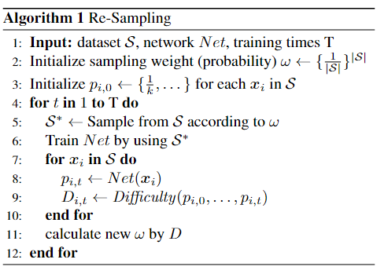
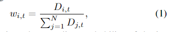
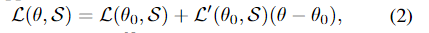
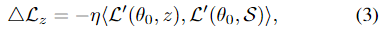
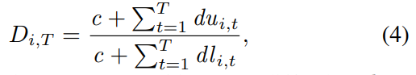
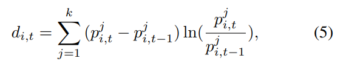
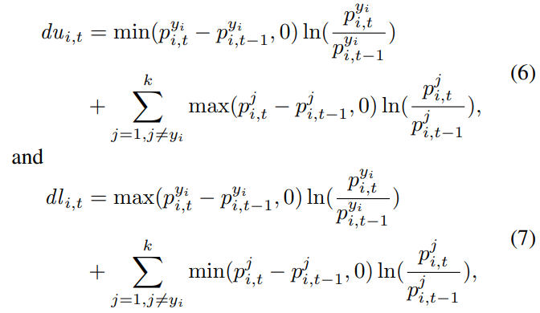

> 论文：A Re-Balancing Strategy for Class-Imbalanced Classification Based on Instance Difficulty (2022 CVPR)

## 本文重采样策略框架

数据分布会极大地影响模型的学习，本文方法只调整训练中使用的数据分布来优化模型。使用的重采样方法的整体训练框架伪代码如下所示：

重采样方法的核心在于计算所有实例的抽样权重，与现有的class-balance等采样方法不同的，即使类别相同，本文方法中的每个实例的采样概率也可能不同。**本文方法的灵感来与应该更多关注学习困难样本的观点**。抽样权重的计算公式如下：

其中 $w_{i,t}$ 是实例 $z_i$ 在第 $t$ 个epoch之后的采样的概率， $D_{i,t}$ 为实例 $z_i$ 在第 $t$ 个epoch估计的学习难度。

## 样本难度模型
### 理论分析
当用梯度下降法来更新模型参数 $\theta$ ，模型训练目标是使得损失函数 $\ell(\theta,S)$ 减小。根据Taylor展开式，当 $\theta\rightarrow\theta_{0}$，有以下等式成立：

为了使得下降速度最快， $\bigtriangleup\theta = (\theta - \theta_0) = -\eta\ell'(\theta_0, S)$ ， 其中 $\eta$  是学习率。
假设模型参数从 $\theta_0$ 更新成 $\theta_1$ ，且 $\theta_1 = \theta_0 - \eta\ell'(\theta_0, S)$ 。对于特定的实例 $z$ ，在模型参数更新之后，损失也随之改变，损失变换量可以由以下公式估计：

其中<., .>表示向量内积。如果 $\bigtriangleup\ell_z$ > 0，称在更新阶段， $z$ 为遗忘的，反之 $z$ 为学习的。可以据此构造 $S$ 的两个子集，分别是辅助集 $A_z = \{a:a\in S,\bigtriangleup\ell_z < 0\}$ 和阻碍集 $H_z = \{a:a\in S,\bigtriangleup\ell_z > 0\}$ 。实例损失的减小表示实例被模型学习的程度，由此可见 Az 中的样本提供了帮助，而 Hz 中的样本则产生了阻碍。当 Az 中任意实例的权重降低或 Hz 中任意实例的权重增加时，z 的损失将变得更加难以减少，说明实例的难易程度受数据分布的影响。
此时的一种朴素的想法是，学习的样本难度可以通过所有梯度两两求内积来评估，但是这样的计算非常复杂，速度太慢。由于二阶可微假设，当模型参数受到轻微扰动时，梯度变化不大。在相邻的两次迭代中，当 $\bigtriangleup\theta$  较小时模型的预测变化趋势相似，因此可以利用上一次迭代中的预测变化来估计当前迭代中的变化。
### 模型设计
确定样本的难度考虑了学习方向和遗忘方向的预测变化，具体来说对于给定实例 $z_i$，其经过 $t$ 次迭代后的难度估计为如下公式。其中 $c$ 为实例难度的先验参数， $du_{i,t}$ 为 $t$ 次迭代后在负学习方向上的预测变化， $dl_{i,t}$ 为在学习方向上的预测变化。所有样本都有相同的 $c$，该参数调节了难度对预测变化的敏感性。

上述公式中的分子记录负学习趋势的积累，分母记录了学习趋势的积累。在初始化阶段，所有样本的困难被初始化为 $D_{i,0}=1$。对于任何样本 $z_i$ 和 $z_j$， $D_{i,t}>D_{j,t}$ 的实例说明在更新了 $t$ 次迭代之后， $z_i$ 比 $z_j$ 更困难。  
本文中根据 PSI(Population Stability Index, 稳定度指标)来定义 $du_{i,t}$ 和 $dl_{i,t}$。PSI 是一个衡量分布之间距离的指标，无论学习方向如何，预测值在 $p_{i,t-1}$ 和 $p_{i,t}$ 之间的变化如下公式定义，其中 $p^j_{i,t-1}$ 表示 $Net_t$ 预测 $z_i$ 为类别 $j$ 的概率。

其中 $p^{y_i}_{i,t}−p^{yi}_{i,t-1}>0$ 表示学习， $p^{y_i}_{i,t}−p^{yi}_{i,t-1}<0$ 表示负学习。由于数据集往往有多个类别，因此将  $du_{i,t}$ 和 $dl_{i,t}$ 定义为如下公式，使其满足 $d_{i,t} = du_{i,t}+dl_{i,t}$。

