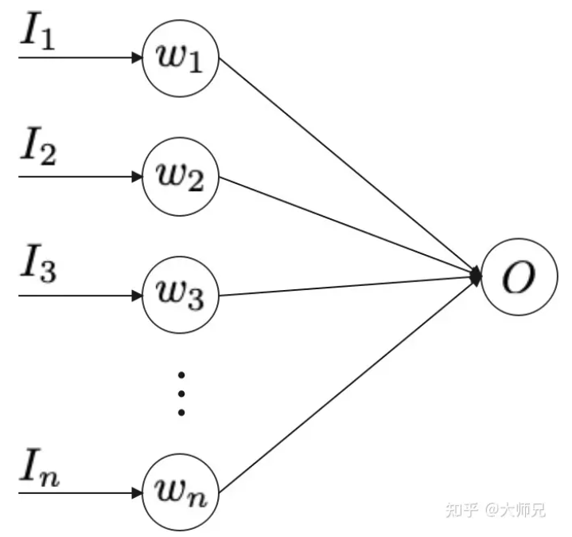

### Dropout 的代码实现方式：

## 1. 什么是Dropout

没有添加Dropout的网络是需要对网络的每一个节点进行学习的，而添加了Dropout之后的网络层只需要对该层中没有被Mask掉的节点进行训练，如图1所示。Dropout能够有效缓解模型的过拟合问题，从而使得训练更深更宽的网络成为可能。

图1：左侧是普通的两层MLP，右侧是添加了Dropout之后的网络结构

在Dropout之前，正则化是主要的用来缓解模型过拟合的策略，例如l1正则和l2正则。但是它们并没有完全解决模型的过拟合问题，原因就是网络中存在co-adaption（共适应）问题。

所谓co-adaption，是指网络中的一些节点会比另外一些节点有更强的表征能力。这时，随着网络的不断训练，具有更强表征能力的节点被不断的强化，而更弱的节点则不断弱化直到对网络的贡献可以忽略不计。这时候只有网络中的部分节点才会被训练，浪费了网络的宽度和深度，进而导致模型的效果上升收到限制。

而Dropout的提出解决了co-adaption问题，从而使得训练更宽的网络成为可能。

## 2. Dropout的数学原理

图2是一个线性的神经网络，它的输出是输入的加权和，表示为式(1)。这里我们只考虑最简单的线性激活函数，这个原理也适用于非线性的激活函数，只是推导起来更加复杂。

$$O = \sum_{i}^{n}{w_i}{I_i} \tag{1}$$

图2：单层线性网络

对于图2的无Dropout的网络，如果使用MSE作为损失函数，它的误差可以表示为式(2)，其中 *t* 是目标值。

$$E_N = \frac{1}{2}(t - \sum_{i=1}^{n}{w_{i}^{'}I_i})^2 \tag{2}$$

(2)式之所以使用 *w*'是为了找到之后要介绍的加入Dropout的网络的关系，其中 $w' = pw$。那么(2)可以表示为式(3)。

$$E_N = \frac{1}{2}(t - \sum_{i=1}^{n}{p_iw_iI_i})^2 \tag{3}$$

它关于*w*i 的导数为式(4)。

$$\frac{\partial E_N}{\partial w_i} = -tp_iI_i + w_ip_i^2I_i^2 + \sum_{j=1,j \neq i}^{n}{w_jp_ip_jI_iI_j} \tag{4}$$

当我们向图2中添加Dropout之后，它的误差表示为式(5)。 $\delta$∼Bernoulli(*p*) 是丢失率，它服从伯努利分布，即它有 *p* 的概率值为 1 ， 1−*p* 的概率值为 0 。

$$E_D = \frac{1}{2}(t - \sum_{i=1}^{n}{\delta_iw_iI_i})^2 \tag{5}$$

它关于 $w_i$ 的导数表示为式(6)。

$$\frac{\partial E_D}{\partial w_i} = -t\delta_iI_i + w_i\delta_i^2I_i^2 + \sum_{j=1,j \neq i}^{n}{w_j\delta_i\delta_jI_iI_j} \tag{6}$$

因为 $\delta_i$ 是一个伯努利分布，我们对其求期望：

$$
\begin{align}
E\Big[\frac{\partial E_D}{\partial w_i}\Big] &= -tp_iI_i + w_ip_i^2I_i^2 + w_iVar(\delta_i)I_i^2 +\sum_{j=1,j \neq i}^{n}{w_jp_ip_jI_iI_j}\\
&=\frac{\partial E_D}{\partial w_i} + w_iVar(\delta_i)I_i^2\\
&=\frac{\partial E_D}{\partial w_i} + w_ip_i(1 - p_i)I_i^2 \tag{7}
\end{align}
$$

对比式(6)和式(7)我们可以看出，在 $w' = pw$ 的前提下，带有Dropout的网络的梯度的期望等价于带有正则的普通网络。换句话说，Dropout起到了正则的作用，正则项为 $w_ip_i(1 - p_i)I_i^2$  。

## 3. Dropout是一个正则网络

通过上面的分析我们知道最小化含有Dropout网络的损失等价于最小化带有正则项的普通网络，如式(8)。

$$E_R = \frac{1}{2}(t - \sum_{i=1}^{n}{p_iw_iI_i})^2 + \sum_{i=1}^{n}{p_i(1 - p_i)w_i^2I_i^2} \tag{8}$$

也就是说当我们对式(8)的 $w_i$ 进行求偏导，会得到(4)式的带有Dropout网络对 $w_i$的求偏导相同的结果。因此可以得到使用Dropout的几个技巧：

1. **当丢失率为**0.5**时，Dropout会有最强的正则化效果**。因为 $p_i(1 - p_i)$ 在 $p_i$=0.5 时取得最大值。
2. **丢失率的选择策略**：在比较深的网络中，使用 0.5 的丢失率是比较好的选择，因为这时Dropout能取到最大的正则效果；在比较浅层的网络中，丢失率应该低于 0.2 ，因为过多的丢失率会导致丢失过多的输入数据对模型的影响比较大；不建议使用大于 0.5 的丢失率，因为它在丢失过多节点的情况下并不会取得更好的正则效果。
3. **在测试时需要将使用丢失率对** $w$ **进行缩放**：基于前面 $w' = pw$ 的假设，我们得知无Dropout的网络的权值相当于对Dropout的网络权值缩放了 $1 - p$ 倍。在含有Dropout的网络中，测试时不会丢弃节点，这相当于它是一个普通网络，因此也需要进行 $1 - p$ 倍的缩放。

$$y = (1 - p)f(WX) \tag{9}$$

关于Dropout的理论依据，业内还有很多讨论，除了上面的正则和减轻co-adaption的作用之外，还有以下比较有代表性的讨论：

1. 模型平均：Hinton等人认为由于Dropout在训练过程中会随机丢弃节点，这也就使得在训练过程中产生了大量不同的网络，而最终的网络相当于这些随机网络的模型的平均；
2. 贝叶斯理论：在机器学习中，贝叶斯理论是指根据一些先验条件，在给定数据集的情况下确定参数的后验分布。一些作者认为[5]，使用Dropout训练的方法可以用使用确定近似值的贝叶斯模型来解释。这么说可能不好理解，我们用更简单的方式来说明，一个神经网络往往有几百万甚至更多的节点，在它基础上丢弃节点后产生的子网络是宇宙级别的数字。如果我们使用bagging训练这些模型时，需要训练海量级别的参数独立的模型，然后再对这些模型取均值。Dropout不同于bagging的一点是Dropout的参数是共享的，而正是这种参数共享使得Dropout可以在有限的时间和硬件条件下实现对无限大量级的模型的训练。因为虽然很多模型并没有完整的参与到训练流程中，但是它的子网络参与了某个训练步骤，正是这个被训练的子网络先验，导致了剩余的子网络也可以有很好的参数设定。

## 4. CNN的Dropout

不同于MLP的特征层是一个特征向量，CNN的Feature Map是一个由宽，高，通道数组成的三维矩阵。按照传统的Dropout的理论，它丢弃的应该是Feature Map上的若干个像素点，但是思想方法在CNN中并不是十分奏效的，一个重要的原因便是临近像素点之间的相似性。因为他们不仅在输入的值上非常接近，而且他们拥有相近的邻居，相似的感受野以及相同的卷积核。因此Dropout在CNN上也有很多优化。

在CNN中，我们可以以通道为单位来随机丢弃，这样可以增加其它通道的建模能力并减轻通道之间的共适应问题，这个策略叫做Spatial Dropout [6]。我们也可以随机丢弃Feature Map中的一大块区域，来避免临近像素的互相补充，这个方法叫做DropBlock[7]。还有一个常见的策略叫做Max-pooling Dropout [8]，它的计算方式是在执行Max-Pooling之前，将窗口内的像素进行随机mask，这样也使的窗口内较小的值也有机会影响后面网络的效果。Spatial Dropout，DropBlock和Max-Pooling Dropout的可视化如图3所示。

图3：CNN常用的Dropout策略

## 5. RNN的Dropout

和CNN一样，传统的Dropout并不能直接用在RNN之上，因为每个时间片的Dropout会限制RNN保留长期记忆得能力，因此一些专门针对RNN的Dropout被提了出来，针对RNN上的Dropout的研究主要集中在LSTM上。RNNDrop[9]提出我们可以在RNN的循环开始之前生成一组Mask，这个mask作用到LSTM的cell states上，然后在时间片的循环中保持这一组Mask的值不变，如式(10)。

$$c_t = (f_t \otimes  h_{t-1} + i_t \otimes  \hat c_{t})  \otimes  m \tag{10}$$

其中 m∼Bernoulli⁡(p)。Recurrent Dropout [10]则提出也可以将掩码作用到更新cell state的地方，同样它的掩码值也保持不变，如式(11)。

$$c_t = f_t \otimes  h_{t-1} + i_t \otimes \hat c_{t}\otimes m \tag{11}~$$

Yarin Gal等人提出Dropout也可以作用到LSTM的各个们上[11]，如式(12)。

$$
\begin{pmatrix}i\\
f\\
g\end{pmatrix}=
\begin{pmatrix}\sigma\\
\sigma\\
\sigma\\
tanh\end{pmatrix}\bigg(
\begin{pmatrix}x_t \otimes z_x\\
h_{t-1}\otimes z_h\end{pmatrix}\cdot W\bigg)\tag{12}
$$

其中 $z_x$ 和 $z_h$ 是作用到输入数据和隐层节点状态的两个掩码，它们在整个时间步骤内保持不变。

## 6. Dropout的变种

### 6.1 高斯Dropout

在传统的Dropout种，每个节点以 1−p 的概率被mask掉。反应到式(5)中，它表示为使用权值乘以 $\delta$，$\delta$∼Bernoulli(p) 服从伯努利分布。式(5)相当于给每个权值一个伯努利的Gate，如图4所示。

图4：Dropout可以看做给每个权值添加一个伯努利的gate和高斯Gate

如果将图4中的伯努利gate换成高斯gate，那么此时得到的Dropout便是高斯Dropout，如图5所示。在很多场景中，高斯Dropout能够起到等价于甚至高于普通Dropout的效果。

在使用高斯Dropout时，因为激活值保持不变，因此高斯Dropout在测试时不需要对权重进行缩放。因为在高斯Dropout中，所有节点都参与训练，这样对提升训练速度也有帮助。在高斯Dropout中，每个节点可以看做乘以了 p(1−p) ，这相当于增熵，而Dropout丢弃节点的策略相当于减熵。在Srivastava等人的论文中，他们指出增熵是比减熵更好的策略，因此高斯Dropout会有更好的效果。

### 6.2 DropConnect

DropConnect[3]的思想也很简单，它不是随机将隐层节点的输出置 0 ，而是将节点中的每个与其相连的输入权值以一定概率置 0 ，它们一个是输出，一个是输入，表示为式(13)。

$$r = a((M\otimes W)v) \tag{13}$$

其中 M 是二值掩码矩阵，它里面的每一个元素服从伯努利分布。Dropout可以看做是对计算完成结果进行掩码，而DropConnect可以看做对输入权值的进行掩码，如图5所示。

图5：Dropout和DropConnect的异同

在测试时，使用所有可能的Mask的结果求均值的策略是不现实的，因为所有掩码的情况共有 $2^{|M|}$ 种，因此在DropConnect通常采用高斯采样的方式来你和全部枚举的结果。DropConnect的测试过程表示为下面伪代码。

### 6.3 StandOut

在Dropout中，每个节点以相同概率 p的伯努利分布被丢弃，StantOut[4]提出丢弃的概率 p 应该是自适应的，它的值取决于权重的值，一般权重越大，被丢弃的概率越高。在训练时，StandOut的节点被丢弃的概率表示为式(14)。

$$m_i \simeq Bernoulli(g(W_sX)) \tag{14}$$

其中 $W_s$ 是网络权值， g是激活函数，也可以是一个网络，例如深度置信网络。实验结果表明深度置信网络可以近似为权重的仿射函数，例如我们可以采用sigmoid激活函数。在测试的时候，我们也需要对权值进行缩放。

如图6所示的例子，在StandOut中，一个节点被mask掉的概率取决于它的权值，权值越高它被mask掉的概率越高，这样就避免了网络过分依赖某些少数的节点。

图6：StandOut示意图

### 6.4 蒙特卡洛Dropout

蒙特卡洛方法本质上是通过有限次的采样，来拟合一个测试结果。这里要介绍的蒙特卡洛Dropout（MCDropout）[12]可以使用到任何使用Dropout训练的网络中，在训练时MCDropout和原始的Dropout保持相同，但是在测试时它继续保留Dropout的丢弃操作，通过随机采样大量不同的测试结果来产生真实的结果，得到预测结果的均值和方差。因为MCDropout的多次预测是可以并行执行的，因此并不会耗费太长的时间。

论文中MCDropout的理论证明非常复杂，这里我们大致阐述一下它的思想。MCDropout的提出思想主要是作者认为softmax的值并不能反映样本分类的可靠程度。跟我我们对softmax输出向量的观察，值最大的那一类往往是一个非常高的一个值，甚至当它预测错误的时候这个值也有可能大于 0.99 ，这个值作为模型的置信度是非常不可靠的。MCDropout通过在不同的模型上的采样来对同一个数据进行预测，那么根据多次采样的结果便可以得到一个比softmax更可靠的置信度。恰好Dropout是一个天然的不同模型的生成器，所以在测试的时候要保留Dropout。

图8：蒙特卡洛Dropout

## 7. 总结

在这篇文章中我们对Dropout背后的数学原理进行了深入的分析，从而得出了“Dropout是一个正则方法”的背后原理，通过对Dropout的数学分析，我们还得出了使用Dropout的几个技巧：

1. 丢失率设置为 0.5 时会取得最强的正则化效果；
2. 不建议使用大于 0.5 的丢失率。

在CNN和RNN中，由于数据的特征和MLP不同，所以需要针对性的设计Dropout，我们这里讨论了CNN中的Spatial Dropout，DropBlock等。而RNN的Dropout则需要在每个时间片保持相同的掩码以保证模型的捕捉长期依赖的能力，它们的不同点是作用到LSTM内部的不同门或者是直接作用到输出结果。

## Reference

[1] [https://towardsdatascience.com/simplified-math-behind-dropout-in-deep-learning-6d50f3f47275](https://link.zhihu.com/?target=https%3A//towardsdatascience.com/simplified-math-behind-dropout-in-deep-learning-6d50f3f47275)

[2] Srivastava, Nitish, et al. "Dropout: a simple way to prevent neural networks from overfitting." _The journal of machine learning research_ 15.1 (2014): 1929-1958.

[3] Wan L, Zeiler M, Zhang S, et al. Regularization of neural networks using dropconnect[C]//International conference on machine learning. PMLR, 2013: 1058-1066.

[4] Ba, Jimmy, and Brendan Frey. "Adaptive dropout for training deep neural networks." _Advances in neural information processing systems_ 26 (2013): 3084-3092.

[5] Wang, Sida, and Christopher Manning. "Fast dropout training." _international conference on machine learning_. PMLR, 2013.

[6] Tompson, Jonathan, et al. "Efficient object localization using convolutional networks." _Proceedings of the IEEE conference on computer vision and pattern recognition_. 2015.

[7] Ghiasi, Golnaz, Tsung-Yi Lin, and Quoc V. Le. "Dropblock: A regularization method for convolutional networks." _arXiv preprint arXiv:1810.12890_ (2018).

[8] H. Wu and X. Gu, “Towards dropout training for convolutional neural networks,” _Neural Net- works_, vol. 71, no. C, pp. 1–10, 2015.

[9] Moon, Taesup, et al. "Rnndrop: A novel dropout for rnns in asr." _2015 IEEE Workshop on Automatic Speech Recognition and Understanding (ASRU)_. IEEE, 2015.

[10] Semeniuta, Stanislau, Aliaksei Severyn, and Erhardt Barth. "Recurrent dropout without memory loss." _arXiv preprint arXiv:1603.05118_ (2016).

[11] Gal, Yarin, and Zoubin Ghahramani. "A theoretically grounded application of dropout in recurrent neural networks." _Advances in neural information processing systems_ 29 (2016): 1019-1027.