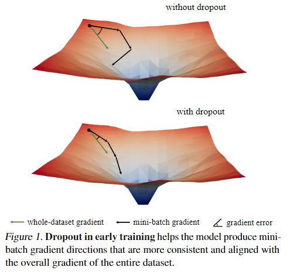
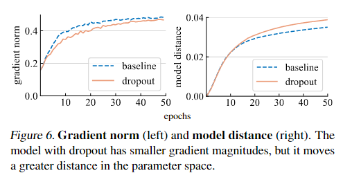
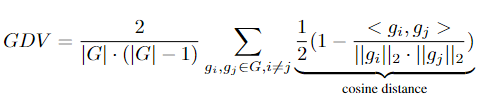
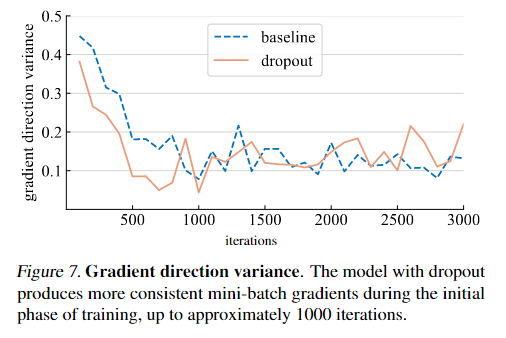
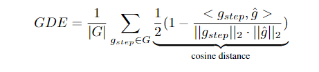
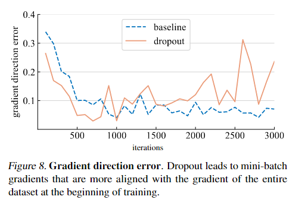

>论文 Dropout Reduces Underfitting

### 总结：
1.  Early dropout：指仅在训练早期使用 dropout，在后面训练过程种关闭 dropout。其可以帮助欠拟合模型拟合的更好。
2. Late dropout：指在训练早期不使用 dropout，在训练后期才开启 dropout。相比于标准的dropout，其提高了过拟合模型的泛化性。

作者通过对**梯度范数**的研究发现，在训练早期，dropout 修正了 mini-batches 的方差，使得模型与整个数据集的梯度方向更加一致（如下图）。换一句话说，dropout 缓解了SGD在训练早期由于 mini-batches 随机采样而导致的过度正则化。
	

对于 drop rate 的选取，作者通过一系列实验表明，**不同模型结构使用不同的 drop rate，drop rate 高度依赖模型大小以及数据集大小**。并且，**数据集越大，或者模型越小，drop rate 也应该更小**。

### How Dropout Can Reduce Underfitting

   

作者通过两个指标来分析的 dropout 对模型泛化性的影响。
一是**Gradient norm**。作者通过梯度 *g* 的二范数 ||*g*||2来分析dropout对梯度的影响力度。如上左图， dropout 模型产生了更小范数的梯度，这说明在梯度更新时，模型更新速度更慢。

二是**Model distance**。作者使用 ||*W*1 - *W*2||2来衡量两个不同模型之间的距离，其中*W*是不同模型的参数。从上右图可以发现，dropout 模型与初始模型的距离，比没用dropout模型的距离更大。这出乎了作者的预料，因为从梯度范数角度上来看，梯度范数越小，模型更新得越慢，模型距离应该是越小的，而上右图的结论与此截然相反。

**droput模型以更小的步幅更新，却与起始模型的距离更大，这说明，dropout以更一致的方向前进，而没用droput的模型，方向随机性比较大，导致可能走了原路。**

三是**Gradient direction variance**。作者提出假设：dropout模型在mini-batches中产生了更一致的梯度更新方向。为了验证这个，作者提出了 gradient direction variance（GDV），通过计算每两个梯度的平均余铉距离：

下图支持了作者的假设，在训练早期（大概1000个iterations），dropout模型产生的梯度方向更加一致。

四是**Gradient direction error**。设 *g* 为模型为推理模式下在整个数据集上的梯度，*g*step为模型在每个mini-batches下的梯度，则 gradient direction error（GDE）的公式为：

**从下图可知，在训练早期，dropout模型产生的梯度方向更接近整个数据集下的梯度方向；在训练后期，非dropout模型产生的梯度方向更接近整个数据集下的梯度方向**。
